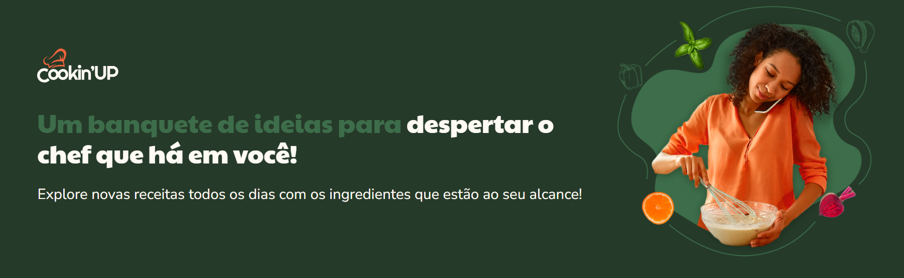

# Cookin' Up!

## About this project

This project was created to learn about `Vue.js` and discover more about this front-end framework. In this course I learned about `v-if`, `v-else`, `v-on:click`, `v-bind`, `v-for` and how to use components to arrange my code.

## Credits to...
This project was created by [Alura](www.alura.com.br).